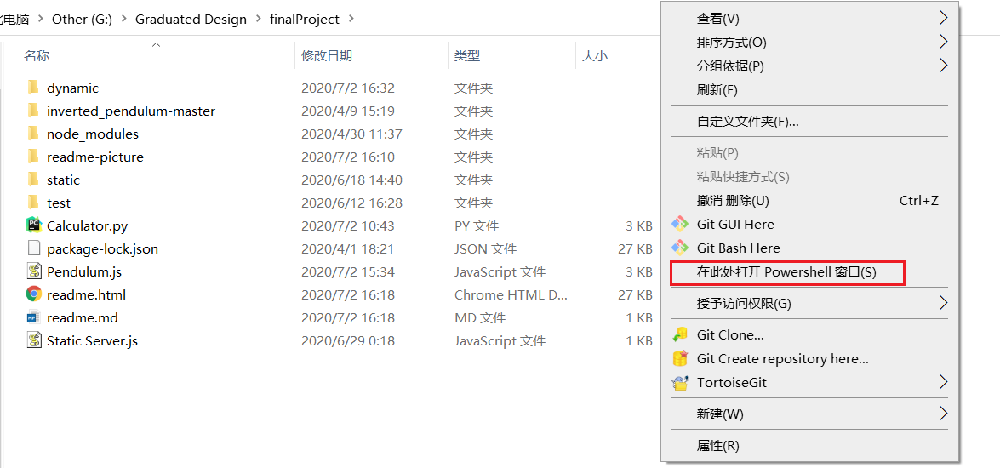
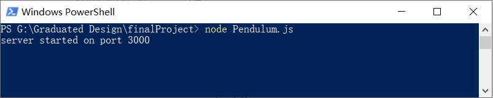
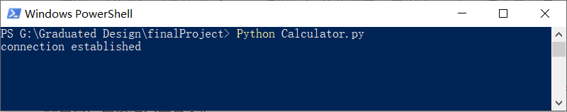
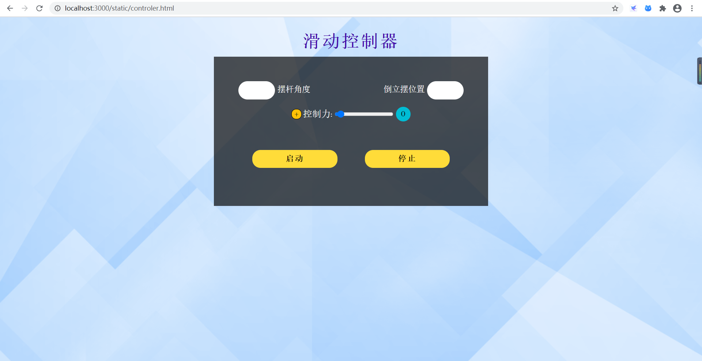
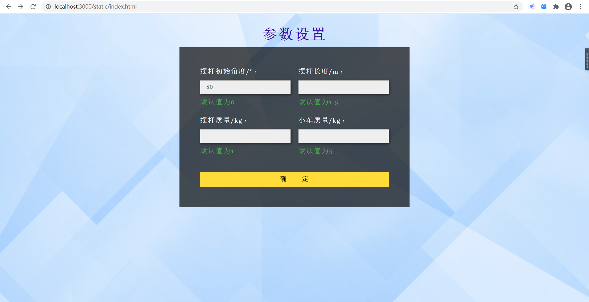

# 虚拟倒立摆实验系统
根据实验设定的控制对象，用精简的物理模型还原实验场景，进一步推导出状态变量与对应参数的微分方程，并借助于Python的相关模块完成微分方程的求解，从而实现模拟对象的建立。而Web前端通过 three.js搭建倒立摆三维模型与场景，与后端Node服务器建立实时通信。服务器获取到用户前端的设置参数与控制器传递的控制信号，进行模拟对象的运算处理，再向前端响应相应的状态量数据，完成倒立摆控制对象的3D动画渲染。 
***

### Node.js环境搭建
安装教程：https://www.runoob.com/nodejs/nodejs-install-setup.html

### Python环境搭建
安装教程：https://www.runoob.com/python/python-install.html

模块安装：https://docs.python.org/zh-cn/3.7/installing/index.html

系统需要引入的Python模块有：socketio、numpy、cv2、json、scipy.integrate
***

### static文件夹
系统静态页面的前端代码与资源，css为样式文件，js为引入的js文件，images为图片资源。

其中controler.html为控制器页面，index.html为参数设置页面。

mime.json为文件后缀名与对应标准响应格式的数据集，用于请求文件的响应（Static Server.js中）。

### dynamic文件夹
系统动态页面的前端代码与资源，model.html为模型展示页面。

### Pendulum.js
node服务端

### Calculator.py
Python计算端

### Static Server.js
静态资源服务，处理静态资源的请求。（Pendulum.js中引入）
***

### 操作步骤
1.使用cmd命令行（快捷键win+R，调出运行命令窗口，并输入CMD），进入主目录。

Tip：亦可使用Powershell工具，在主目录下的空白处使用shift+右键，选择在此处打开Powershell窗口，直接进入主目录。

2.启动nodejs服务端，成功后显示`server started on port 3000`。

`node Pendulum.js`

3.同上，启动Python计算端，成功后显示`connection established`。

`Python Calculator.py`

4.滑动控制器页面：新建浏览器页面，URL地址栏输入`http://localhost:3000/static/controler.html`。

5.参数设置页面：新建浏览器页面，URL地址栏输入`http://localhost:3000/dist/index.html`。

6.设置完参数后，选择确定，即开始实验。

7.在滑动控制器页面选择启动，则倒立摆每间隔3秒会获得相应控制力，并作出响应。（橙色模块可切换+、-，即控制力的方向）
